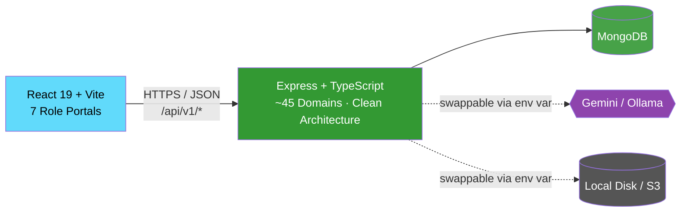
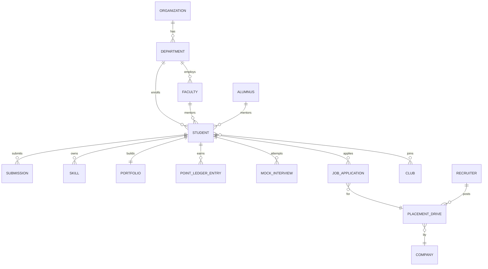

<p align="center">
  
</p>

<h1 align="center">RyuZen — Intelligent Student Journey Platform</h1>

<p align="center">
  <strong>One connected ecosystem for a student's entire university journey — from day one to placement, and beyond.</strong>
</p>

<p align="center">
  
  
  
  
  
</p>

---

## Table of Contents

1. [Problem Statement](#problem-statement)
2. [Our Solution](#our-solution)
3. [System Architecture](#system-architecture)
4. [Tech Stack](#tech-stack)
5. [Project Structure](#project-structure)
6. [Database Schema](#database-schema)
7. [Features](#features)
8. [API Reference](#api-reference)
9. [Getting Started](#getting-started)
10. [Environment Variables](#environment-variables)

---

## Problem Statement

A student walks onto campus and, from day one, is on their own to figure out what actually matters. Academics happen in one place. Clubs and activities happen in another. "Placement prep" doesn't start until final year — like it's a separate project, not the thing every earlier year was quietly building toward. Students lose the thread of their own journey because nothing ever connected the dots for them.

> **Result:** students feel lost and disconnected — treating "doing well academically" and "preparing for placement" as two different jobs, when they were always one.

It's not just the students who are in the dark:

- **Organizations** have no real visibility into what students are actually doing or building — not until placement season starts and it's suddenly urgent to know
- **Recruiters** are handed a résumé and have to take it on faith — no real, verified picture of the person behind it

---

## Our Solution

RyuZen connects the journey instead of splitting it into disconnected checkpoints:

| For | RyuZen gives them |
|---|---|
| **Students** | One continuous record — activities, skills, mentorship, and placement prep as one journey, not two |
| **Organizations** | Real visibility into student growth as it happens, not a scramble to assess it when placements begin |
| **Recruiters** | Verified evidence — real skills, projects, and achievements — instead of a résumé's word for it |

---

## System Architecture



TypeScript-based modular monolith. Every domain follows the same four layers — `domain → application → infrastructure → presentation` — and a use case never touches a Mongoose model directly, only a repository interface injected through a per-domain container. That's what makes the AI provider and storage backend swappable with one env var, not a code change.

---

## Tech Stack

| Layer | Technologies |
|---|---|
| **Frontend** | React 19, TypeScript, Vite, Tailwind CSS v4, React Router v7, TanStack Query, GSAP, Radix UI |
| **Backend** | Node.js, Express, TypeScript, Mongoose, Zod, JWT, bcryptjs, Multer |
| **AI** | Google Gemini or Ollama (swappable), voice via the Web Speech API |
| **Storage** | Local disk or S3-compatible object storage (swappable) |
| **Testing** | Vitest |

---

## Project Structure

```
RyuZen/
├── apps/
│   ├── frontend-v2/src/
│   │   ├── domains/       # Shared types, API services, React Query hooks
│   │   ├── portals/       # 7 role-based portals
│   │   └── shared/        # UI primitives, layout, API client
│   └── backend/src/
│       ├── domains/       # ~45 business domains, Clean Architecture
│       ├── shared/        # storage, upload, http, middleware
│       └── app.ts
└── seed/                  # Realistic, connected demo data
```

---

## Database Schema



Each domain owns its own MongoDB collection — no cross-domain joins, relationships resolved through real repository calls.

---

## Features

- **Academics** — activities, faculty-reviewed submissions, a hash-chained tamper-evident point ledger, mentorship, attendance via rotating QR codes, timed assessments
- **Career** — portfolio, AI-extracted evidence-backed skills, faculty-verified certifications, resume builder with a real ATS score
- **Campus Life** — browsable clubs with real activity feeds, events, badges
- **Placements** — drives, applications with real eligibility checks, interview rounds, recruiter-scoped visibility
- **AI Layer** — Career Score, AI chat, resume review, and mock interviews with voice I/O, hybrid AI+deterministic scoring, adaptive difficulty, and full history
- **Alumni** — graduates stay connected and mentor current students

---

## API Reference

| Method | Endpoint | Description |
|---|---|---|
| `POST` | `/api/v1/auth/login` | Login, receive JWT tokens |
| `GET/POST` | `/api/v1/activities` | List / create activities |
| `POST` | `/api/v1/submissions/:id/review` | Approve/reject — awards real ledger points |
| `GET` | `/api/v1/point-ledger/audit` | Independently re-verify the hash chain |
| `GET/PATCH` | `/api/v1/portfolio/me` | Get/update own portfolio |
| `GET` | `/api/v1/clubs` | Browse clubs |
| `POST` | `/api/v1/attendance/mark` | Mark attendance via rotating QR token |
| `POST` | `/api/v1/applications/:placementId` | Apply to a drive |
| `POST` | `/api/v1/ai/interview` | Start a mock interview |
| `POST` | `/api/v1/ai/interview/:id/answer` | Submit an answer — real scoring + adaptive difficulty |

---

## Getting Started

```bash
git clone https://github.com/GaliAkshatha/RyuZen.git
cd RyuZen

# Backend
cd apps/backend
npm install
cp .env.example .env   # fill in real values
npm run seed            # optional, realistic demo data
npm run dev

# Frontend (new terminal)
cd apps/frontend-v2
npm install
cp .env.example .env
npm run dev
```

Frontend: `http://localhost:5173` · Backend: `http://localhost:5000/api/v1`

---

## Environment Variables

### Backend
| Variable | Description |
|---|---|
| `MONGODB_URI` | MongoDB connection string |
| `JWT_SECRET` | Signs JWTs |
| `AI_PROVIDER` | `gemini` or `ollama` |
| `GEMINI_API_KEY` | Required when using Gemini |
| `STORAGE_PROVIDER` | `local` or `s3` |
| `FRONTEND_URL` | Real frontend origin(s) — used for CORS |

### Frontend
| Variable | Description |
|---|---|
| `VITE_API_BASE_URL` | Backend API base URL |

---

<p align="center">
  Built by <strong>Akshatha</strong>
</p>